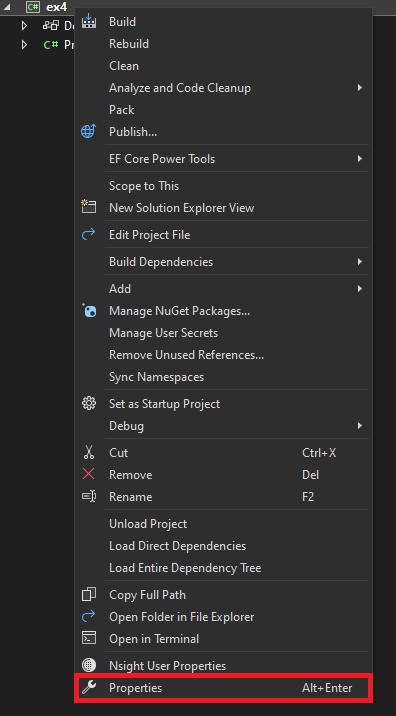
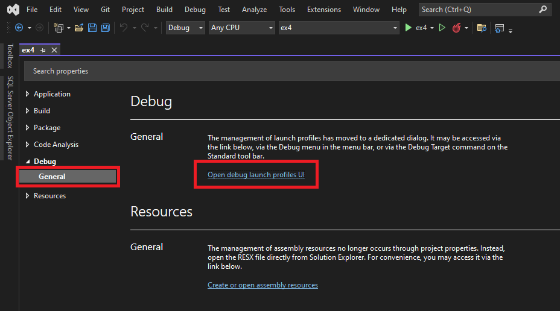
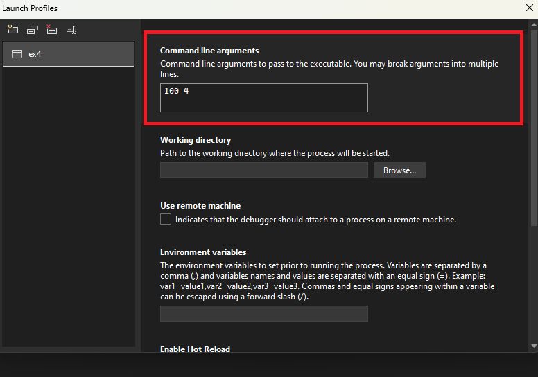

## Exerciții

1. Analizați și rulați programul din proiectul **ex01**. 
    - Ce se întâmpla dacă comentați join-urile?
    - Când își termină execuția thread-ul principal?

2. Analizați și rulați programul din proiectul **ex02**.
    - Ce valoare are `sharedVariable` la finalul programului?
    - Ce valoare are `sharedVariable` la finalul programului dacă modificați numărul de iterații din `IncrementSharedVariable()` și `DecrementSharedVariable()` la 100.000?
    - Ce valoare are `sharedVariable` dacă decomentați secțiunea `lock` pentru activarea protecției?

3. Analizați și rulați programul din proiectul **ex03**.
    - Ce se întâmplă dacă comentați apelul `Thread.Sleep()`?
    - Schimbați numărul de iterații la 100.000. Descrieți comportamentul cu și fără `Thread.Sleep()`.

4. Implementați un program (**ex04**) ce verifică primalitatea elementelor unui vector folosind unul sau mai multe **thread**-uri (`System.Threading.Thread`).
    - Thread-ul principal va afișa la începutul și la sfârșitul programului ora curentă. 
    - Thread-ul principal va genera un vector de N numere întregi. După pornirea thread-urilor, acesta va scrie într-un fișier (`primes_in.txt`) vectorul de elemente generat.
    - Fiecare thread creat va afișa în consolă id-ul propriu, limitele de căutare, și numărul de elemente prime identificate din secțiunea de vector alocată: '`Thread 1: [0, 24] => 33`'. În plus, fiecare va scrie elementele prime identificate separate printr-un spațiu într-un fișier cu denumirea ce respectă următorul format: `primes_THREAD_ID_out.txt`. *Obs: `THREAD_ID` reprezintă id-ul thread-ului.*
    - Numărul de elemente, `N`, va fi transmis ca argument la program.
    - Numărul de thread-uri, `P`, va fi transmis ca argument la program.
    - Testați pentru mai multe valori ale lui N. E.g. 1.000, 100.000, 10.000.000

    Exemple afișare:
    ```
    Current time: 16:19:48:1948
    Thread 0: [0, 250000] => 22044
    Thread 1: [250000, 500000] => 19494
    Elapsed Time is 35275 ms
    Current time: 16:20:23:2023
    ```

    ```
    Current time: 16:24:40:2440
    Thread 0: [0, 62500] => 6275
    Thread 1: [62500, 125000] => 5459
    Thread 2: [125000, 187500] => 5230
    Thread 3: [187500, 250000] => 5080
    Thread 4: [250000, 312500] => 4948
    Thread 5: [312500, 375000] => 4912
    Thread 6: [375000, 437500] => 4852
    Thread 7: [437500, 500000] => 4782
    Elapsed Time is 11411 ms
    Current time: 16:24:52:2452
    ```

Argumentele la program se setează accesând proprietățile proiectului:

Pas 1                                             |Pas 2                                            |Pas 3                                        |
:------------------------------------------------:|:-----------------------------------------------:|:------------------------------------------:|
 || |

5. Implementați un program (**ex05**) ce verifică primalitatea elementelor unui vector folosind unul sau mai multe **thread**-uri (`System.Threading.Thread`) de tip **background**.
    - Ce diferențe observați în execuție față de programul de la exercițiul anterior (**ex4**)? 
    - Ați folosit `Join()`? Testați programul atât cu `Join()` cât și fără `Join()`.

6. Analizați și rulați programul din proiectul **ex06**.
    - La o primă vedere, programul este foarte asemănător cu cel de la **ex02**, doar că de această dată este folosită clasa `System.Threading.Monitor`. Descrieți comportamentul programului.
    - Comentați liniile ce conțin `Monitor.Enter()` și `Monitor.Exit()`. Decomentați secțiunile de `lock` (împreună cu scope-ul `{}`). Descrieți comportamentul programului. 

7. În proiectul **ex07** implementați un program ce rezolvă problema din codul inițial de la programul **ex06** fără a folosi o altă primitivă de sincronizare în plus.
    - Hint: Asigurați-vă că `Monitor.Exit()` va fi apelat de fiecare dată.
    - Hint: Intern, `lock` este implementat folosind `Monitor`.

8. Analizați și rulați programul din proiectul **ex08**.
    - Ulterior, rulați mai multe instanțe ale programului folosind executabilul generat la calea `.\ex8\bin\Debug\net6.0\ex8.exe`.
    - Descrieți ce se întâmplă? De ce apare o eroare/excepție?

9. În proiectul **ex09** implementați un program ce rezolvă/tratează eroarea/excepția.

10. Analizați și rulați programul **ex10**.
    - Descrieți ce se întâmplă (urmăriți valorile pentru `_READ_READ_CHECK`, `_WRITE_WRITE_CHECK`, `_READ_WRITE_CHECK`).
    - Decomentați liniile 24 (`_mapAreas[newMapArea.Alias] = newMapArea;`) și 52 (`_mapAreas.TryGetValue(alias, out mapArea);`). Ce observați?
    - Rezolvați problema folosind [`System.Threading.ReaderWriterLockSlim`](https://learn.microsoft.com/en-us/dotnet/api/system.threading.readerwriterlockslim?view=net-6.0).