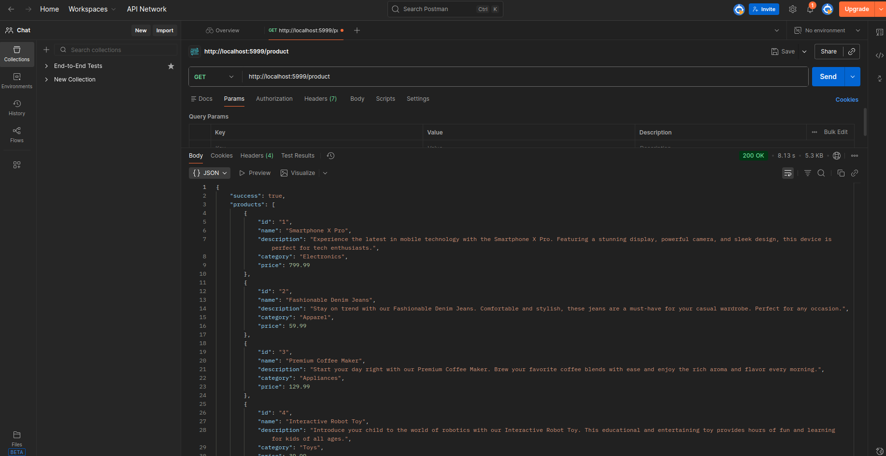
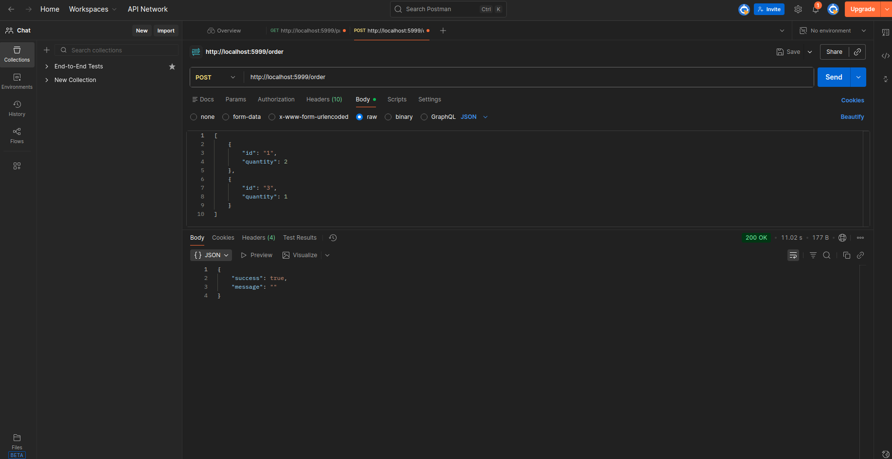

# Laborator 9

## Exercitiul 1

╭─tavi@tavi-LOQ-15IAX9 ~/Parallel-Algorithms-Labs/lab09/ex01
╰─➤ dotnet run

Press ENTER to cancel the operation.
Thread 4: working phase 1...
Thread 4: working phase 2...
Thread 4: working phase 1...
Thread 4: working phase 2...

Thread 4: cleanup
Main thread existing...

**Explicatie:** CancellationToken permite oprirea coordonata a thread-urilor. Thread-ul verifica periodic daca a fost solicitat cancel prin `IsCancellationRequested`. Daca decomentam linia 32 (`ThrowIfCancellationRequested`), thread-ul va arunca exceptie `OperationCanceledException` in loc sa verifice doar flag-ul.

---

## Exercitiul 2

**Explicatie:** Programul imparte sirul in segmente si fiecare thread cauta in segmentul sau. Cand un thread gaseste subsirul, afiseaza pozitia si timpul scurs, apoi anuleaza celelalte thread-uri folosind `CancellationToken`.

---

## Exercitiul 3

**Explicatie:** Fisierul este impartit in segmente egale, fiecare thread cripteaza un segment cu o cheie unica si IV unic. Thread-ul principal concateneaza segmentele criptate si salveaza cheile cu delimitatoarele in fisierul `_keys.txt`.

---

## Exercitiul 4

**Explicatie:** Programul citeste fisierul criptat si fisierul cu chei. Fiecare thread decripteaza un segment folosind cheia si IV-ul corespunzator. Segmentele decriptate sunt apoi concatenate pentru a reconstitui fisierul original.

---

## Exercitiul 5

**Explicatie:** Trei thread-uri lucreaza in pipeline: `requester` obtine URL-uri de la server cu exponential backoff (1s, 2s, 4s...) daca primeste RETRY-LATER, `downloader` descarca imaginile din lista de URL-uri (fara duplicate), si `processer` adauga watermark pe imaginile descarcate. Sincronizarea se face prin liste partajate cu lock-uri.

---

## Exercitiul 6

╭─tavi@tavi-LOQ-15IAX9 ~/Parallel-Algorithms-Labs/lab09/ex06
╰─➤ dotnet run

info: Microsoft.Hosting.Lifetime[14]
      Now listening on: http://localhost:5999
info: Microsoft.Hosting.Lifetime[0]
      Application started. Press Ctrl+C to shutdown.

**Explicatie:** Probleme identificate si rezolvate:

1. **Singleton thread-safety (READ-READ)**: Singleton-ul nu era thread-safe - doua cereri in paralel puteau crea doua instante diferite. Fiecare instanta incerca sa faca conexiune (1-5 secunde), deci primele cereri GET esuau.
   - **Solutie**: Double-checked locking cu `lock` in `SingletonRepository.GetInstance()`.

2. **Write-write conflict in OrderRepository**: Doua thread-uri care adaugau comenzi simultan cauzau eroarea "Write conflict error" pentru ca `_rc` ajungea > 0.
   - **Solutie**: `lock (_lock)` in jurul metodei `AddOrder()`.

**Testare cu Postman:**

GET /product - Raspuns cu lista de produse:

POST /order - Request cu body JSON:

Dupa aplicarea fix-urilor, toate request-urile paralele reusesc fara erori.

---

## Exercitiul 7 (Optional)

**Explicatie:** Tool-ul trimite request-uri HTTP in paralel si genereaza statistici. Argumentele suportate:
- `-P=N`: numarul de request-uri paralele
- `--save-response`: salveaza raspunsurile in fisiere
- `--stat-countsuccess`: afiseaza numarul de request-uri reuite
- `--stat-countfail`: afiseaza numarul de request-uri esuate
- `--stat-meantime`: calculeaza timpul mediu de raspuns
- `--url=URL`: URL-ul de testat
- `--method=METHOD`: metoda HTTP (GET/POST)

