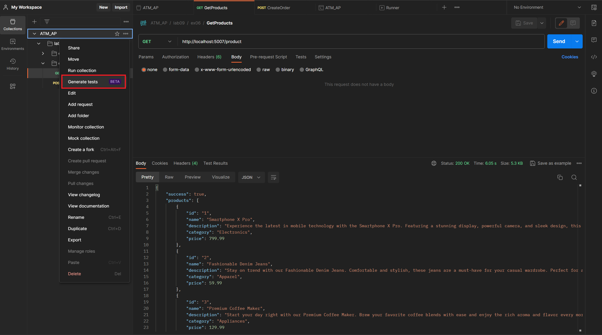
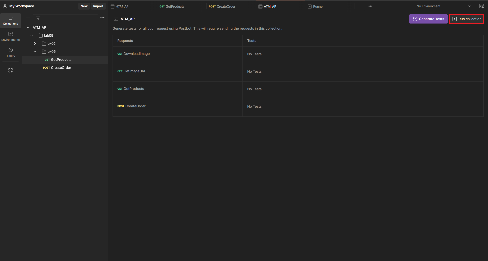
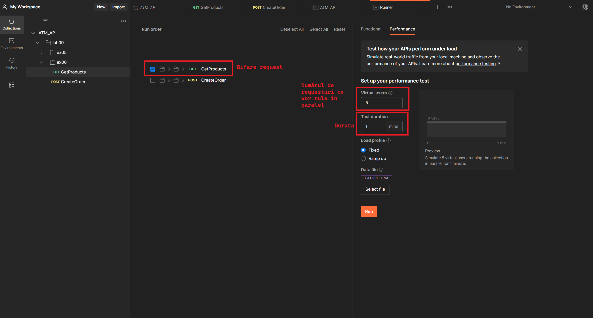
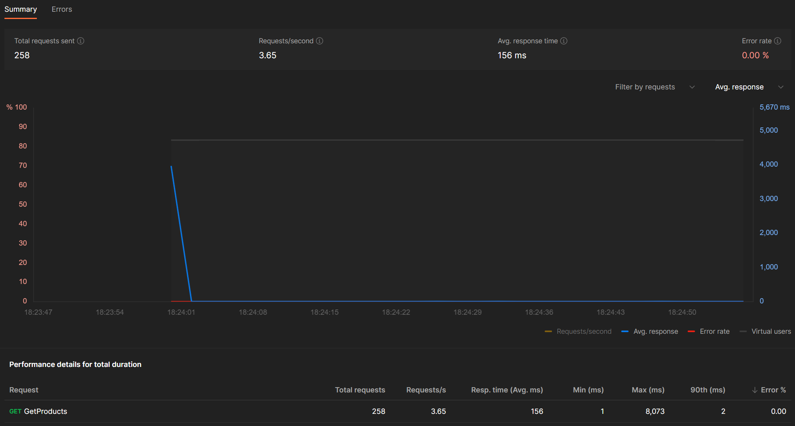

## Exerciții

1. Analizați și rulați programul din proiectul **ex01**.
    - Care este scopul utilizării `CancellationToken`?
    - Care este efectul decomentării liniei 32 "`cancellationToken.ThrowIfCancellationRequested();`"?

2. În **ex02**, folosind `CancellationToken`, implementați un program ce realizează căutarea unui subșir într-un șir folosind mai multe thread-uri. În momentul în care unul din thread-uri găsește o primă apariție a subșirului, toate celelalte thread-uri vor opri căutarea.
    - În cazul în care subșirul există, programul va afișa (în consolă) linia `Thread [THREAD_ID]: Found at [INDEX].`, unde `INDEX` reprezintă poziția (indexul) primului caracter al subșirului în șirul de căutat.
    - Pe deasupra, se va afișa linia `Elapsed time: [ELAPSED_TIME].`, unde `ELAPSED_TIME` reprezintă timpul scurs de la pornirea thread-urilor pentru căutarea subșirului, până la găsirea subșirului, sau până la căutarea exhaustivă, în cazul inexistenței subșirului.
    - Testați implementarea pentru 1, 2, 4, respectiv 8 thread-uri.

    Exemplu afișare:
    ```
    Thread 14: Found at [336188004].
    Elapsed time: 947ms
    ```

3. Pentru **ex03**, implementați un program care efectuează o criptare AES multithreading. 
    - Thread-ul principal citește fișierul. Apoi, el generează un număr de chei egal cu numărul de thread-uri ce vor fi instanțiate pentru criptare.
    - În urma criptării, vor rezulta un număr de secțiuni criptate, egal cu numărul de thread-uri: ES1, ES2, ES3, .... Astfel, thread-ul principal concatenează secțiunile criptate, pe urmă va salva rezultatul într-un fișier `INPUT_FILE_encrypted.bin`, unde `INPUT_FILE` reprezintă numele fișierului de intrare.
    - Pentru decriptarea fișierului rezultat `INPUT_FILE_encrypted.bin`, este nevoie ca thread-ul principal să salveze cheile folosite împreună cu delimitatoarele aferente fiecărei chei. În acest sens, va fi creat un fișier `INPUT_FILE_encrypted_keys.txt` având următorul format:
    ```
    NUM_KEYS
    KEY_1_START_RANGE KEY_1_END_RANGE KEY_1_FILENAME KEY_1_IV_FILENAME
    KEY_2_START_RANGE KEY_2_END_RANGE KEY_2_FILENAME KEY_2_IV_FILENAME
    KEY_3_START_RANGE KEY_3_END_RANGE KEY_3_FILENAME KEY_3_IV_FILENAME
    ...
    ```
    - Măsurați și notați timpul necesar pentru criptarea fișierului pentru 1, 2, 4, respectiv 8 thread-uri.
    - Pentru a nu irosi timp cu generarea unor fișiere de intrare, este recomandat să folosiți fișierele de la **ex02**, adică `books.txt` și `booksLarge.txt`.
    
4. În **ex04** implementați un program care realizează decriptarea rezultatului de la **ex03**.
    - Măsurați și notați timpul necesar pentru decriptarea fișierului pentru 1, 2, 4, respectiv 8 thread-uri.

5. În arhiva **backend.zip** există un server HTTP ce expune portul 5000. Implementați un client care trimite cereri către `localhost:5000/image`.    
    - Răspunsul de succes al serverului va fi de forma:
    ```JSON
    {
        "status": "SUCCESS",
        "url": "some-image-url"
    }
    ```
    - Serverul poate răspunde cu statusul `RETRY-LATER` ceea ce însemnă că momentan nu are imagini disponibile.
    ```JSON
    {
        "status": "RETRY-LATER"
    }
    ```
    - Programul va crea 3 thread-uri.
    - Thread-ul **requester** va adăuga într-o listă URL-ul primit. Dacă serverul nu are resurse disponibile, pentru a evita trimiterea de cereri inutile către server, clientul va implementa un mecaninsm de retry de tipul [exponential backoff](https://learn.microsoft.com/en-us/dotnet/architecture/microservices/implement-resilient-applications/implement-retries-exponential-backoff). Astfel, dacă după prima cerere se primește un răspuns eșuat, se așteaptă o secundă înainte să se trimită următoarea cerere. În cazul în care răspunsul nu este unul de succes, se așteaptă 2 secunde, apoi 4 secunde ș.a.m.d., până la primirea unui răspuns de succes.
    - Un alt thread (**downloader**) va accesa lista pentru a descărca și salva imaginile în fișiere. Atenție, fiecare imagine va fi descărcată o singură dată.
    - Al treilea thread (**processer**) va adăuga un [watermark](https://github.com/SixLabors/Samples/blob/main/ImageSharp/DrawWaterMarkOnImage/Program.cs) asupra imaginilor descărcate și le va salva concatenând la denumirea lor șirul `.watermarked`. De exemplu, în urma procesării imaginiii `image_0.jpg` va rezulta imaginea sub având denumirea `image_0.watermarked.jpg`.

6. Se dorește implementarea unui serviciu de tip REST API thread-safe pentru procesarea de comenzi în contextul unui magazin online. Interogarea produselor disponibile se realizeaza prin intermediul unui request GET către `localhost:5999/product`. Plasarea unei comenzi se realizează prin crearea unei cereri HTTP de tip POST către `localhost:5999/order` având următorul format:
    ```JSON
    {
        "$schema": "http://json-schema.org/draft-07/schema#",
        "type": "object",
        "properties": {
            "products": {
                "type": "array",
                "items": {
                    "type": "object",
                    "properties": {
                        "id": {
                            "type": "string"
                        },
                        "quantity": {
                            "type": "integer"
                        }
                    },
                    "required": [
                        "id",
                        "quantity"
                    ]
                }
            }
        },
        "required": [
            "products"
        ]
    }
    ```
    După cum se poate observa, fiecare cerere conține o listă de produse (identificator și cantitate).

    Atenție, portul pe care ascultă REST API-ul poate fi modificat prin intermediul setării `applicationUrl` din `ex06/Properties/launchSettings.json`.
    
    Serviciul asigură persistența datelor despre produse și comenzi folosind două instanțe singleton de tipul `OrderRepository` și `ProductRepository`. Cu toate acestea, accesul la instanța repository-ului este deficitară în cazul în care se primesc mai multe cereri în același timp. Sarcina voastră este să analizați codul, să descoperiți problemele, iar apoi să modificați codul în așa fel încât să permită mai multe cereri în paralel.

    - Într-o primă instanță, folosiți [Postman](https://www.postman.com/downloads/) pentru a crea o nouă colecție și a trimite requesturi GET către `http://localhost:5007/product`. Ar trebui să primiți răspunsuri valide (200 OK) din partea serverului.
    - Pe urmă, va fi nevoie să reporniți REST API-ul (Ctrl + F5 **SAU** Ctrl + Fn + F5) și să trimiteți o serie de request-uri în paralel. Vă puteți folosi de funcționalitatea `Generate tests` de la Postman, de tipul `Performance`.
    
    
    
    - În urma rulării unei bateriei de teste ar trebui să observați că primele request-uri nu se realizează cu succes. De ce? Ca să identificați problema Rulați REST API-ul în modul `Debug` (F5 **SAU** Fn + F5).
    - După ce ați rezolvat problema, ar trebui să obțineți **Error rate = 0%**.
    
    - Pe urmă, rulați o baterie de teste asemănătoare cu request-uri de tip POST către `http://localhost:5007/order`. Folosiți-vă de schema JSON definită anterior pentru crearea body-ului request-ului de tip POST. De data aceasta problema este una de tip WRITE-WRITE (au loc două sau mai multe scrieri în paralel).
    - După ce ați rezolvat problema, ar trebui, de asemenea, să obțineți **Error rate = 0%**.

7. (**Opțional**) Postman reprezintă un tool foarte folositor în detecția unor probleme de concurență. Totuși, compania pentru care lucrați dorește dezvoltarea unui tool in-house pentru testarea acestui tip de probleme. Astfel, la **ex07**, implementați un client multithreading care să trimită o serie de request-uri în paralel pentru REST API-ul analizat anterior (și nu numai). Acesta va permite:
    - Trimiterea în paralel a unui număr de request-uri, definit printr-un argument, e.g. **-P=8**.
    - Salvarea răspunsurilor primite de la server, definit printr-un argument, e.g. **--save-response**
    - Realizarea unor statistici, de pildă: 
        - numărarea request-urilor care au avut loc cu succes, e.g. **--stat-countsuccess**
        - numărarea request-urilor care nu au avut succes, e.g. **--stat-countfail**
        - calcularea timpului mediu de răspuns, e.g. **--stat-meantime**