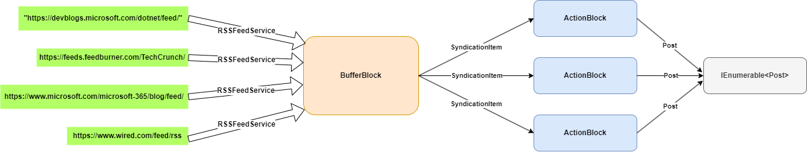

## Exerciții

1. Analizați și rulați programul din **ex01** ce exemplifică utilizarea [Task.Factory.StartNew](https://learn.microsoft.com/en-us/dotnet/api/system.threading.tasks.taskfactory.startnew?view=net-6.0).
   -    În contextul creării lui `childTask`, folosiți-vă de `TaskCreationOptions` pentru a asigura faptul că acesta își va finaliza sarcina.
   -    În contextul creării lui `parentTask`, ce efect are utilizarea `TaskCreationOptions.DenyChildAttach`?
   -    Care este diferența dintre `Task.Run()` și `Task.Factory.StartNew()`? Pe lângă concluziile rezultate în urma analizei realizate pe cod, găsiți mai multe în [documentația oficială](https://devblogs.microsoft.com/pfxteam/task-run-vs-task-factory-startnew/).

2. Porning de la scheletul din **ex02** este necesar să implementați, folosind programare paralelă dinamică, analiza unui graf specific rețelelor sociale (e.g. LinkedIn, Facebook, Instagram). Mai precis, programul dezvoltat va realiza o procesare în paralel a nodurilor astfel:
   -    Programul începe cu procesarea simultană a primului nivel de noduri.
   -    Pentru fiecare nod, după finalizarea sa, se continuă cu procesarea simultană a tuturor celor K copii (vecinii direcți).
   -    Procedeul anterior se repetă până când toate nodurile grafului au fost procesate.

3. La **ex03** implementați un program ce realizează analiza în paralel a tuturor fișierelor și directoarelor copil pentru un director a cărui cale este transmisă ca argument la program. De exemplu, să considerăm următoarea ierarhie de fișiere și directoare:

    ```
    dir_1
    ├───dir_01
    │   ├───file_1.c
    │   ├───file_2.py
    │   ├───file_3.txt
    |   └───dir_001
    |       └───file_4.c
    ├───dir_02
    │   ├───file_5.txt
    |   └───file_6.txt
    ├───test.yml
    └───docker-compose.yml
    ```
    Presupunând că programul primește calea directorului `dir_1`, acesta afișează un rezultat de forma:
    ```
    Files count: 8
    Folders count: 3
    Total file size: 23500124 bytes
    Last written file: file_4.c
    Last written file time: 10/10/2023 13:13:06
    ```

4. Analizați și rulați programul din **ex04** care exemplifică utilizarea blocurilor de procesare de date specifice `System.Threading.Tasks.Dataflow` ce fac parte din categoria `Buffering Blocks`.
   - În cazul utilizării `BufferBlock`, ce se întâmplă dacă măriți numărul de iterații pentru bucla cu apelul de `Receive()`? Păstrând numărul mărit de iterații, modificați modificați codul din interiorul buclei astfel încât programul să își finalizeze execuția.
   - În cazul utilizării `BroadcastBlock`, ce se întâmplă dacă decomentați linia cu al doilea apel al `Post()`?
   - În cazul utilizării `WriteOnceBlock`, descrieți comportamentul în cazul decomentării liniei cu al doilea apel al `SendAsync()`? Ce valori sunt afișate pentru alte eventuale apeluri `ReceiveAsync()`?

5. Analizați și rulați programul din **ex05** care exemplifică utilizarea blocurilor de procesare de date specifice `System.Threading.Tasks.Dataflow` ce fac parte din categoria `Execution Blocks`.
   - Care este diferența majoră dintre `ActionBlock` și `TransformBlock`?
   - Descrieți comportamentul programului în cazul în care transmiteți un număr negativ blocului de tip `TransformManyBlock`. Tratați problema fără a modifica metoda de tip delegate transmisă ca parametru constructorului `TransformManyBlock`.

6. Analizați și rulați programul din **ex06** care exemplifică utilizarea blocurilor de procesare de date specifice `System.Threading.Tasks.Dataflow` ce fac parte din categoria `Grouping Blocks`.
   - Care este rezultatul blocului `BatchBlock`?
   - Dar al blocului `JoinBlock`?
   - Folosindu-vă de `BatchedJoinBlock`, și pornind de la exemplele de utilizare ale `BatchBlock`, respectiv `JoinBlock`, creați grupuri a cate maximum 3 mașini și afișați mașina cu prețul cel mai mic.

7. Analizați și rulați programul din **ex07** ce exemplică crearea unui flux folosind blocuri din `System.Threading.Tasks.Dataflow`.
   - Ce efect are setarea valorii lui `Greedy` în `false` în cadrul `joinWoodStoneBlock`? Dar în cadrul lui `joinWoodIronBlock`? Dar în ambele join-uri?
   - Eficitientizați codul.

8. În **ex08**, pornind de la `RSSFeedService` și folosind blocuri din `System.Threading.Tasks.Dataflow`, implementați fluxul din imaginea de mai jos.

    

9. În **ex09**, folosindu-vă de implementarea `RSSFeedService`, realizați un flux specific `System.Threading.Tasks.Dataflow`, ce are ca rezultat final o listă (`List<string>`) cu numele categoriilor din postările dintr-un feed RSS (e.g. https://www.wired.com/feed/rss). 
   - Fiecare nume poate să apară o singură dată în listă.
   - Fiecare nume de categorie va fi salvat cu majuscule.
   - Rezultatul final va fi afișat în consolă folosind un `ActionBlock`.